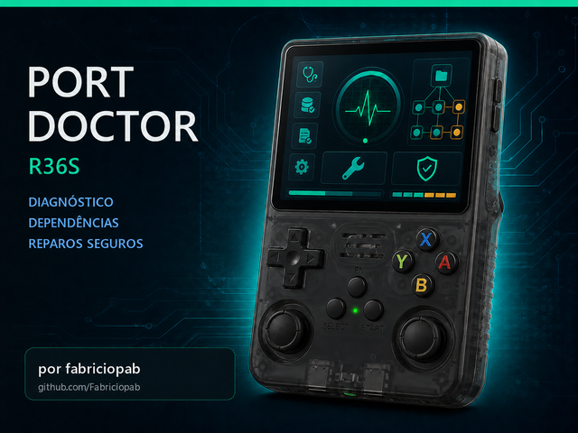
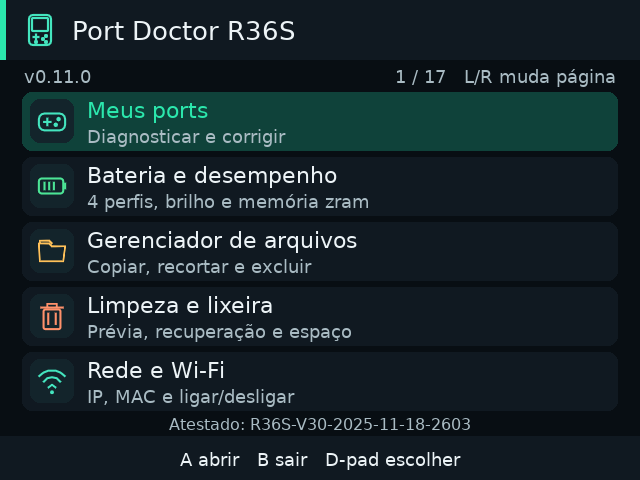

# Port Doctor R36S

**Diagnóstico, reparos assistidos e manutenção do R36S — pelo próprio console.**

Criado por **fabriciopab**, para ajudar a comunidade a entender por que um port não abre, aplicar correções compatíveis e cuidar dos arquivos, capas, rede e desempenho sem depender de SSH.

[Baixar a última versão](https://github.com/Fabriciopab/Port-Doctor-R36S/releases/latest) · [Como instalar](INSTALACAO.md) · [Manual completo](FUNCIONALIDADES.md) · [Relatar problema](https://github.com/Fabriciopab/Port-Doctor-R36S/issues)

<p align="center"></p>

> **Atestado no R36S-V30-2025-11-18-2603, com dArkOSRE.** A identificação da revisão foi informada pelo mantenedor. Os testes nesse aparelho não certificam outros modelos, clones, firmwares ou todos os jogos. O projeto permanece experimental.

**Sistema operacional usado nos testes: dArkOSRE (base Debian 13).** Esse aviso também aparece na tela inicial do aplicativo e em **Modelo e sistema testados**. dArkOSRE é a referência destes testes; não deve ser confundido com uma validação de todos os outros firmwares chamados dArkOS/ArkOS.

**Novo na 0.12.0:** o **Port Hub local** acessa a pasta `R36S-Ports` do computador, lista os ports pelo próprio console e instala no cartão escolhido. Antes de copiar, valida pacote e espaço; depois confere a transferência, libera o launcher e recusa sobrescritas de jogos e saves.

## Instalação rápida — sem SSH e sem chmod

1. Abra [Releases / Downloads](https://github.com/Fabriciopab/Port-Doctor-R36S/releases/latest) e baixe **`Port-Doctor-R36S-Instalador-v0.12.0.zip`** ou o instalador da versão mais recente.
2. Extraia o ZIP no computador. Copie a pasta inteira **`Port Doctor R36S Installer`** para **`tools`** no cartão de jogos. No console, ela corresponde a `/roms/tools` ou `/roms2/tools`.
3. Coloque o cartão novamente no R36S, abra **Tools / Ferramentas** e execute **Instalar Port Doctor R36S**. Se o menu mostrar a pasta do instalador, entre nela primeiro.
4. Aguarde a conclusão sem desligar. O instalador organiza os arquivos, preserva a instalação anterior e aplica as permissões automaticamente.
5. Abra **Ports → Port Doctor R36S**. Tenha internet na primeira abertura caso o runtime LÖVE ainda precise ser baixado pelo PortMaster.

```text
Cartão de jogos/
└── tools/
    └── Port Doctor R36S Installer/
        ├── Instalar Port Doctor R36S.sh
        ├── portdoctor.zip
        └── LEIA-ME.txt
```

**Não use “Code → Download ZIP” para instalar:** esse é o código-fonte. Não extraia o ZIP interno `portdoctor.zip` para usar o instalador. Não coloque uma pasta extra `Port-Doctor-R36S-v…` dentro de `ports`.

O método pelo menu Tools foi testado no dArkOSRE indicado acima e evita o fluxo de instalação automática do PortMaster que travou nos testes. Não é necessário acessar terminal, SSH ou executar `chmod` nesse sistema. O firmware precisa oferecer execução de scripts em Tools e integração PortMaster; não há promessa de instalação universal em qualquer clone.

[Guia completo de instalação, atualização e solução de problemas](INSTALACAO.md)

## Todas as funcionalidades

| Função | O que você pode fazer |
| --- | --- |
| **Meus ports** | Selecionar um jogo, analisar dependências e logs e abrir a correção recomendada na mesma página. Verificar o resultado e desfazer o último reparo quando disponível. |
| **Bibliotecas e dependências** | Identificar arquivos ausentes, vazios/truncados e arquitetura incompatível. Usar cópias locais compatíveis, isoladas no jogo, sem sobrescrever `/lib`. |
| **PortMaster e runtimes** | Consultar bibliotecas, catálogos e runtimes; instalar runtimes declarados e atualizar catálogos/backend pelo HarbourMaster, com confirmação. |
| **Áudio e vídeo** | Tratar casos reconhecidos de OpenAL/PipeWire, ALSA ocupado e inicialização EGL/GLES. A correção depende das evidências e do ambiente disponível. |
| **GameMaker e outros ports** | Verificar pacotes incompletos, reconstruir `.port` com compressão incompatível e tratar dependências locais. Diagnosticar JARs incompletos, falhas nativas e builds de outra plataforma. |
| **Capas dos jogos** | Reconhecer imagens `cover` e `cove` em PNG/JPG/JPEG, criar cópia com o nome do launcher `.sh` e registrar no `gamelist.xml`, preservando o original. |
| **Gerenciador de arquivos** | Navegar nos cartões, copiar com conferência de integridade, recortar/colar, renomear, criar pastas, consultar propriedades e excluir para a lixeira. |
| **Desinstalar jogos** | Mostrar o launcher `.sh` e a pasta associados ao port antes de mover o conjunto para a lixeira. Recusar associações ambíguas ou compartilhadas. |
| **Limpeza e lixeira** | Encontrar resíduos reconhecidos, revisar a lista, recuperar itens ou apagar definitivamente com confirmação. Não é uma limpeza indiscriminada do Linux. |
| **Bateria e desempenho** | Ver sensores e ajustar brilho; escolher Padrão, Equilibrado, Economia ou Desempenho, respeitando os limites do firmware. **Sem overclock.** |
| **Memória e zram** | Consultar RAM/swap e, em sistemas compatíveis, criar zram própria de 25%, 50% ou 75% da RAM visível, com verificações e restauração. |
| **Rede e Wi-Fi** | Consultar IP, MAC, interfaces e conexão; ligar/desligar o rádio Wi-Fi quando o NetworkManager está disponível. |
| **USB / OTG** | Configurar acesso aos cartões pelo cabo USB/RNDIS em imagens compatíveis ou restaurar o modo OTG para o dongle, com diagnóstico, backup e confirmação de reinício. |
| **Jogos em rede** | Importar configuração do Windows, conectar/desconectar compartilhamento SMB/CIFS e diagnosticar acesso às pastas de ROMs. Inclui preparador para o PC. |
| **Port Hub local** | Listar ports guardados no Windows e instalá-los no cartão 1 ou 2 com validação, cópia temporária, conferência e proteção contra sobrescrita. |
| **Sistema e armazenamento** | Ver arquitetura, glibc, memória, espaço, subsistema gráfico/áudio, controles e capacidade de gravação/permissões. |
| **Relatórios e backups** | Exportar evidências locais, consultar o último reparo e restaurar alterações compatíveis. |
| **Atualizar Port Doctor** | Consultar a release estável oficial, confirmar o download, validar o pacote e instalar automaticamente após fechar a interface. |

Interface em **640×480**, com **ícones, textos grandes e páginas em tela inteira**, controlada pelo gamepad. Não é necessário procurar em outra aba a correção de um problema identificado.

<p align="center"></p>

O [manual completo](FUNCIONALIDADES.md) detalha recursos, procedimentos, controles e limitações.

## Como reparar um port

1. Tente abrir o jogo e volte ao menu, para que o log reflita o problema atual.
2. Abra **Port Doctor → Meus ports → nome do jogo**.
3. Leia o diagnóstico e escolha **Corrigir problema identificado**, se houver reparo disponível.
4. Confira a proposta e confirme. Alterações compatíveis têm backup e registro.
5. Abra o jogo novamente. Teste imagem, som, controles e carregamento de save.
6. Volte à página do jogo no Doctor e escolha a verificação do último reparo. Se necessário, use a restauração disponível.

**Não existe correção universal.** O Doctor não baixa jogos/dados proprietários, não inventa arquivos ausentes e não transforma um executável incompatível em compatível apenas instalando bibliotecas. Um diagnóstico sem erro novo pode ser inconclusivo: não prova que o jogo abriu. A receita EGL do Hollow Knight só é liberada para os binários e o ambiente reconhecidos; outras falhas SIGBUS/SIGSEGV exigem diagnóstico próprio.

## Atualizações pelo GitHub

O canal oficial vem configurado a partir da **0.11.1**: **[Fabriciopab/Port-Doctor-R36S](https://github.com/Fabriciopab/Port-Doctor-R36S)**.

No console, abra **Atualizar Port Doctor → Verificar atualizações**. A ferramenta mostra versão, origem e tamanho; após sua confirmação, baixa, verifica SHA-256 e estrutura e instala usando o instalador local. Mantenha alimentação estável até terminar.

- Atualiza o **Port Doctor**, não dArkOS, kernel ou firmware.
- Jogos e configurações locais são preservados; a instalação anterior fica em backup.
- Versões antigas que pedem a origem podem usar **Configurar repositório → `Port-Doctor-R36S`**, ou receber o novo instalador pelo menu Tools.
- Consultar não instala sem confirmação. Sem internet ou sem versão mais nova, o app informa a situação.

[Detalhes do canal](PUBLICAR-ATUALIZACOES.md) · [Histórico das versões](CHANGELOG.md)

## Bateria, desempenho e segurança

Os quatro perfis são modos de uso, **não níveis de overclock**. O Doctor não aumenta tensão, limites de frequência ou GPU. Desempenho tem bloqueios preventivos de plataforma, temperatura e carga; a verificação ocorre na ativação, não por monitoramento contínuo. Pode consumir mais energia e gerar mais calor.

Mantenha **Padrão** quando os jogos já funcionam. Zram não cria RAM física nem garante FPS: comprime páginas usando CPU. Os tamanhos oferecidos são sugestões do projeto, não configurações certificadas para todos os aparelhos. Perfis e zram manual valem até reiniciar. O gerenciador manual não substitui a zram existente do firmware.

Leia [Segurança, desempenho e zram](SEGURANCA-DESEMPENHO.md) antes de alterar esses ajustes.

## Cuidados importantes

- Faça backup dos saves e do cartão. A lixeira no mesmo cartão não protege contra defeito físico ou queda de energia.
- Ao desinstalar, **saves dentro da pasta do jogo acompanham a pasta**. Revise os caminhos antes de confirmar.
- Mover para a lixeira não libera espaço; só apagar definitivamente libera.
- Não use o gerenciador ao mesmo tempo que transfere arquivos por USB/rede.
- USB/OTG pode alterar configuração de boot/DTB em imagens compatíveis e exige reinício. É separado de ligar o rádio Wi-Fi.
- USB não cria senha padrão nem troca credenciais. O Explorador exige uma conta Samba configurada; se ela não existir, use a configuração do firmware ou SFTP gráfico com suas credenciais existentes. O Doctor ainda não cadastra senha Samba pela interface.
- Reparos de bibliotecas não sobrescrevem `/lib`, não trocam glibc/drivers centrais nem misturam ARMHF com AArch64.
- Dependências específicas de USB/rede podem ser instaladas com confirmação. O app não executa atualização geral por `apt upgrade`.

## Suporte e privacidade

Abra uma [issue](https://github.com/Fabriciopab/Port-Doctor-R36S/issues) com versão do Doctor, revisão do R36S, firmware, nome do port, passos e log relevante. [Como contribuir e relatar falhas](CONTRIBUTING.md).

Os diagnósticos são locais e o programa não publica relatórios automaticamente. Consultas/downloads usam os serviços necessários à ação solicitada. Antes de compartilhar relatórios, remova senhas e dados pessoais. **Nunca publique `Jogos-em-Rede-R36S.conf`**: a senha nele não é criptografada, mesmo quando codificada em Base64.

## Créditos e apoio ao projeto

**Autor e mantenedor: fabriciopab**

- GitHub: **[github.com/Fabriciopab](https://github.com/Fabriciopab)**
- Projeto: **[Port-Doctor-R36S](https://github.com/Fabriciopab/Port-Doctor-R36S)**
- E-mail: **fabricio@byteforce-ai.com**
- **Chave Pix: `fabriciopab@hotmail.com`**

As contribuições são voluntárias e ajudam a apoiar a continuidade do projeto. **Nenhuma função exige pagamento ou doação.** A chave também aparece na tela **Contribuir com o projeto**, no console.

Agradecimentos às comunidades **PortMaster, dArkOSRE e ArkOS**, aos autores dos runtimes e a quem testa e relata problemas. Este é um projeto comunitário independente, não um produto oficial dessas comunidades ou do fabricante do console.

## Licença e desenvolvimento

Código próprio sob [licença MIT](LICENSE), mantendo os créditos de **fabriciopab**. Integrações e componentes de terceiros conservam suas licenças. Jogos, ROMs, BIOS e arquivos proprietários **não acompanham** o projeto.

[Arquitetura e testes](DEVELOPMENT.md) · [Verificação da release e downloads](TESTES-v0.11.3.md) · [Testes físicos da 0.11.0](TESTES-v0.11.0.md) · [Créditos](AUTHORS.md)
